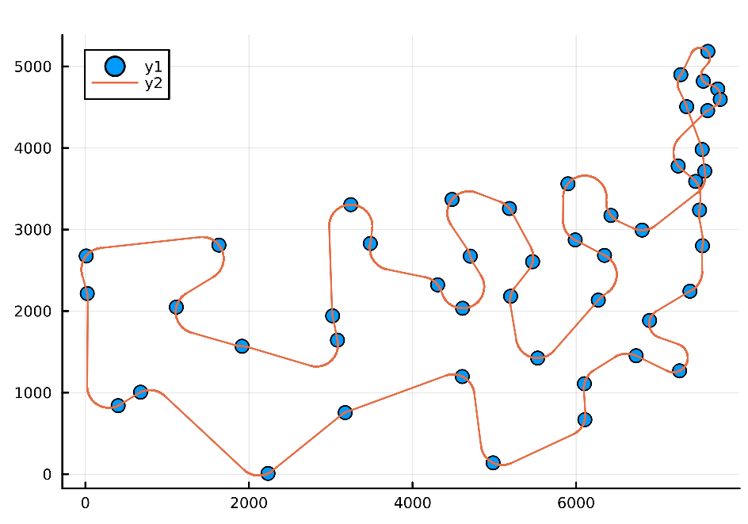
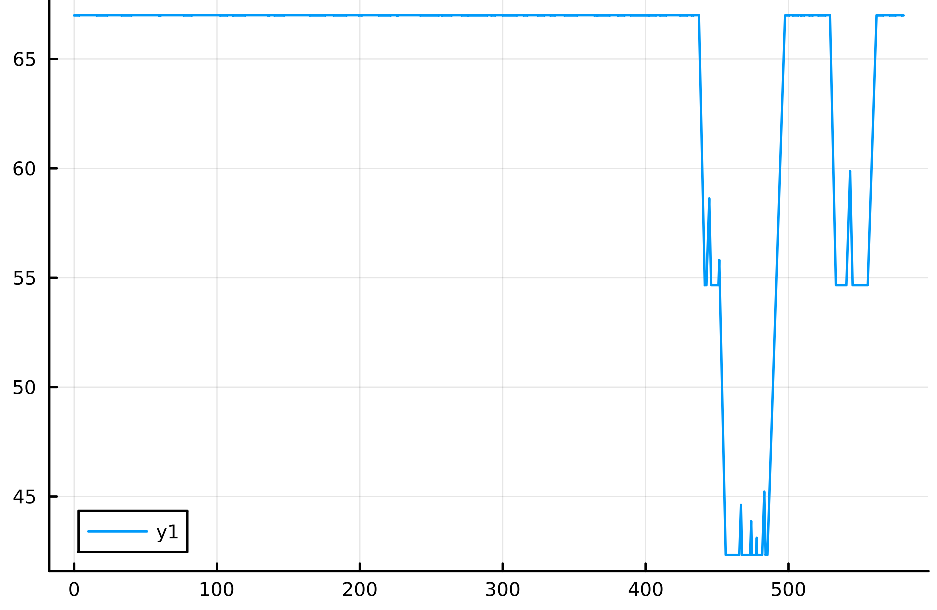
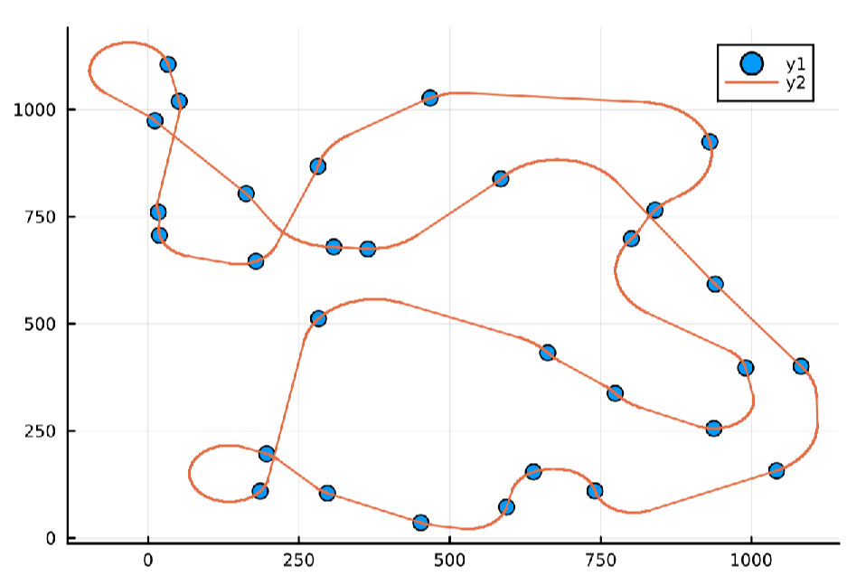
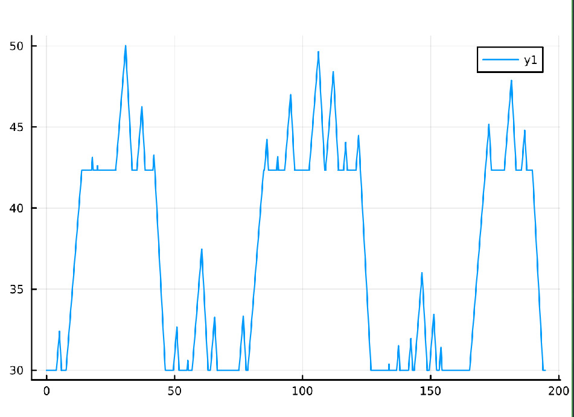

# vs-tsp
Julia implementation of the Variable-Speed Travelling Salesman Problem documented on `Kučerová, Kristýna & Váňa, Petr & Faigl, Jan. (2021). Variable-Speed Traveling Salesman Problem for Vehicles with Curvature Constrained Trajectories. 4714-4719. 10.1109/IROS51168.2021.9636762.`. The [Accelerated Dubins library](https://github.com/comrob/AcceleratedDubins.jl) was also adapted for proper use.

## Basic usage

The base source file `VsTsp.jl` can be imported by your Julia script or directly from the REPL, then used as follows:

```julia
#"Default" vehicle parameters, you can also make your own with VehicleParameters struct
params = VsTsp.get_cessna172_params()
#Read a .tsp file and get time graph for curves
graph, speed, heading, radii = VsTsp.get_graph("./instances/random.tsp", params)
#Execute the algorithm
path, points, config = VsTsp.vns_tsp(g, "./instances/random.tsp", params, speed, heading, radii)
#Plot resulting path/speeds
VsTSp.Visual.plot_full_path(points, path)
VsTsp.Visual.plot_full_speeds(path, params)
```

## Result example path/speed profile (default parameters)
- **att48**





- **Random Instance**



